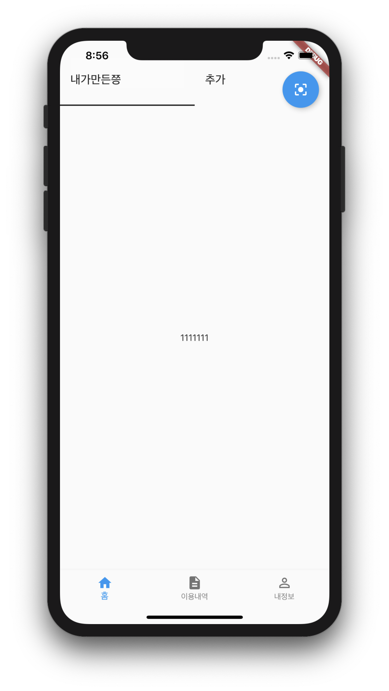

# flutter-pratice

## Flutter ButtonNaviationBar

## Flutter TabBar over the ButtonNavigationBar

## Flutter FloatingActionButton with 'FloatingActionButtonLocation' and adjusted position
> FloatingActionButton is moved at top-right and moved position down using 'EdgeInsets'
> FloatingActionButton is shown only first 'NavigationBar' in the 'ButtonNavigationBar' 

