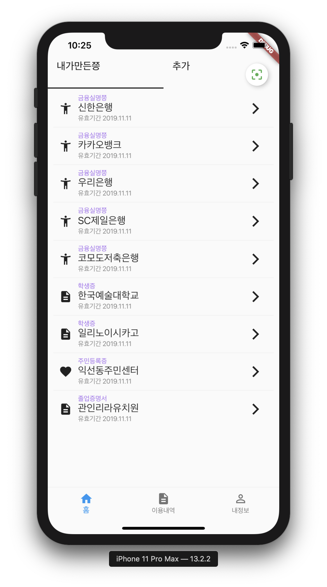

# flutter-pratice

#### Flutter Fingerprint authentication using 'local_auth' 
- /lib/ui/my/mypage.dart
- pubspec.yaml 

#### Flutter ButtonNaviationBar

#### Flutter TabBar over the ButtonNavigationBar

#### Flutter FloatingActionButton with 'FloatingActionButtonLocation' and adjusted position
> FloatingActionButton is moved at top-right and moved position down using 'EdgeInsets'
> FloatingActionButton is shown only first 'NavigationBar' in the 'ButtonNavigationBar' 

